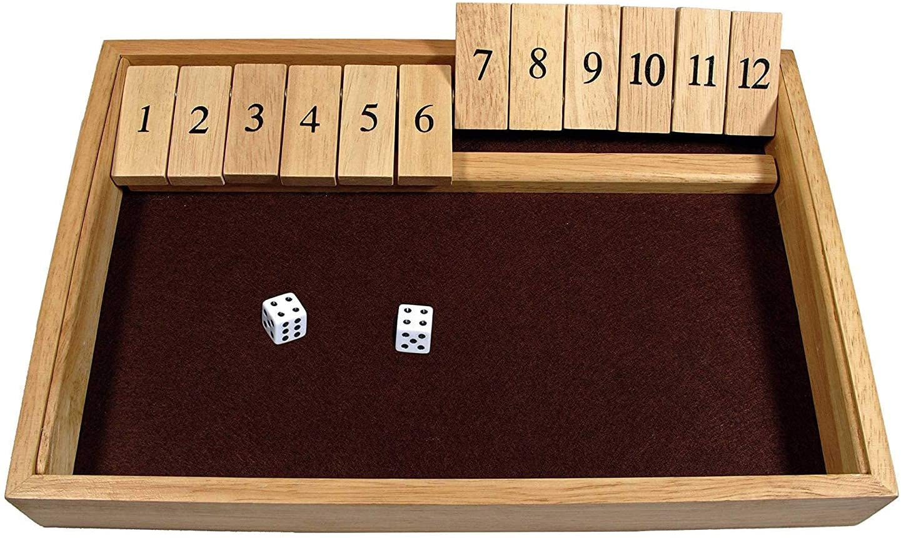

## sbt project compiled with Scala 3

### Usage

This is a normal sbt project. You can compile code with `sbt compile`, run it with `sbt run`, and `sbt console` will start a Scala 3 REPL.

For more information on the sbt-dotty plugin, see the
[scala3-example-project](https://github.com/scala/scala3-example-project/blob/main/README.md).

# Shut the Box
Project for a Software Engineering class

A simplified version of the Board Game Shut the Box!

## How the Game works
* You begin with 9 Open Boxes. 
* The Aim of the Game is to shut as many Boxes as Possible.
* Roll Two Dices, then close one or more Boxes such that the Sum
  of the Boxes closed is equal to your Dice Roll. 
* The Game Ends when you're unable to close boxes that are equal to your Dice Roll.
>>Remember, a lower Score is better!!

 